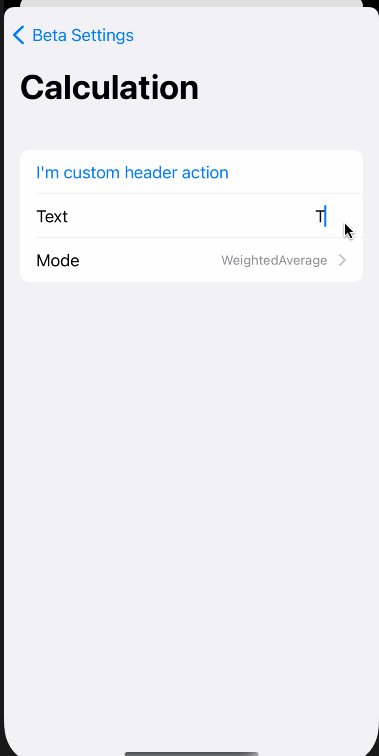

## Data driven settings screens



[Watch overview demo on YouTube](https://www.youtube.com/watch?v=MTY9m2--tiA&feature=youtu.be)

Almost every app contain some kind of settings screens, most apps usually contain debug settings along user facing ones, the implementation of those screens in `UIKit` could really get complicated, emergence of `SwiftUI` had simplified this a lot, but I believe this could be streamlined even more by leveraging data driven approach and [Sourcery]().

That's where **`AutomaticSetttings`** fits in.

Settings are:

- `Codable`
- based on pure swift value types
- UI is generated by Sourcery but developers retain ability to customize it
- All changes are tracked and can be reviewed before applying them (like a transaction)
- Settings can be marked as requiring restart or triggering side-effects

### How does it work?

You have a master structure for your settings e.g.

```swift
struct BetaSettings: AutomaticSettings {
    struct Calculation: AutomaticSettings {
        var mode = .linearRegression
        var averageMethod = .weightedAverage
        var timePeriod = 7
    }

    var calculation: Calculation = .init()
}
``` 

[Sourcery](https://github.com/krzysztofzablocki/Sourcery) analyzes your structure and generates functions for each settings and sections, you simply provide a content function to your main view:

```swift
extension BetaSettingsView {
    var content: some View {
        calculationLink()
        otherSectionLink()
        Button("Some action that doesn't have data backing") {
            // ...
        }
    }
}
```

If you modify your data structure [Sourcery](https://github.com/krzysztofzablocki/Sourcery) will update the proper functions and your UI will reflect the current state of data.


#### Tweaking Variable behaviour
Variables can be annotated using `// sourcery: annotation` with following options:

- `skipSetting`: will not generate UI for the given variable
- `requiresRestart`: if a variable changes it will force an app restart in the review screen
- `sideEffect`: allows you to add side-effects that should happen when variable changes (e.g. call external controller or some function)
- `range`: if a variable is a Float/Double it allows you specify the range of allowed values e.g. `range = 0.0...1.0`

##### Supported types
We automatically support UI for following types:

- `String`
- `Bool`
- `Int`
- `Float`
- Enums
- `SettingsDisplayable`

For supporting custom enums you can either leverage the enums that implement `CaseIterable, Hashable, RawRepresentable, RawValue == String`, or you can add support for custom type that conforms to `SettingsDisplayable`.
For complex types you can also implement a custom `setting` DSL function for your type.

#### Adding new sections

When you add a new section and mark it with `AutoSettings`, you will need to include it in the `BetaSettingsView+Content.swift` content function by calling either:

- `fooLink()` - will inject the section as a navigation link (only available for top level sections)
- `FooView()` - will create a view containing all the settings for given section

You can alter them with `footerView` / `headerView`. Keep in mind that if you use `injectFooter` / `injectHeader` then you can't provide footer nor header for links as they will auto-call those functions, so you use one or the other approach.

```swift
advertisingLink(footerView: {
                    Button("Report Ad") {
                        //...
                    }
})
```

#### Tweaking section behaviour
Sections can be annotated using `// sourcery: annotation` with following options:

- `injectFooter`: automatically injects sub-section footer via function you define named `sectionNameFooter`
- `injectHeader`: automatically injects sub-section header via function you define named `sectionNameHeader`

Thus allowing you to add headers / footer by simply adding correctly named functions (don't fret as compiler will tell you if you named it wrong) in an extension of `BetaSetingsView` or one of the sections subviews.

The template currently supports nesting upto 2 levels, meaning you can have `BetaSettings.Section.SubSection` but if needed it could be easily extended to deeper nesting levels.

## Installation

Few steps are required:

1. Your project needs [Sourcery](https://github.com/krzysztofzablocki/Sourcery)
3. Copy the Sourcery [template](Stencil/AutomaticSettings.stencil) to your projects templates and configure it.
3. Add this library code to your project, you can use Swift Package Manager / CocoaPods or just copy the few files this project contains.
4. Add view implementation for your settings screen (this is to allow you to customize it further)

If anything is unclear refer to example app. The repo also contains commits that highlight specific parts of the feature set.  

### Configuring the template
The template requires few parameters in your `sourcery.yml` file, add them in `args:` section like this:

```yml
args:
  settingsView: BetaSettingsView
  settingsStructure: BetaSettings
  settingsExternalData: BetaSettingsExternalData
  settingsImports:
    - FrameworkMySettingsNeed
    - MyCustomFrameworkName
    - OtherInternalFramework
```

### Sample view implementation

```swift
struct BetaSettingsView: View, AutomaticSettingsViewDSL {
    private enum Subscreen: Swift.Identifiable {
        case review

        var id: String {
            switch self {
            case .review:
                return "review"
            }
        }
    }

    @ObservedObject
    var viewModel: AutomaticSettingsViewModel<BetaSettings, BetaSettingsExternalData>

    @State(initialValue: nil)
    private var subscreen: Subscreen?

    var body: some View {
        NavigationView {
            content
                .sheet(item: $subscreen, content: { subscreen in
                    Group {
                        switch subscreen {
                        case .review:
                            reviewScreen
                        }
                    }
                })
                .navigationBarTitle("Beta Settings")
                .navigationBarItems(
                    leading: Button("Cancel") {
                        viewModel.cancel()
                    },
                    trailing: Group {
                        if viewModel.applicableChanges.isEmpty {
                            EmptyView()
                        } else {
                            Button("Review") {
                                subscreen = .review
                            }
                        }
                    }
                )
        }
    }

    var reviewScreen: some View {
        NavigationView {
            Form {
                if let changes = viewModel.applicableChanges, !changes.isEmpty {
                    ForEach(changes) { change in
                        VStack {
                            HStack {
                                Text(change.name)
                                Spacer()
                                if change.requiresRestart {
                                    Image(systemName: "goforward")
                                        .renderingMode(.template)
                                        .foregroundColor(.red)
                                }
                            }
                            HStack {
                                Spacer()
                                Text(change.change)
                            }
                        }
                    }
                }
            }
            .navigationBarTitle("Review changes")
            .navigationBarItems(
                leading: Button("Cancel") {
                    subscreen = nil
                },
                trailing: Button("Save\(viewModel.needsRestart ? " & Restart" : "")") {
                    subscreen = nil
                    viewModel.saveChanges()
                }
            )
        }
    }
}

extension BetaSettingsView {
    var content: some View {
        // put your actual settings content here
    }
}
```
